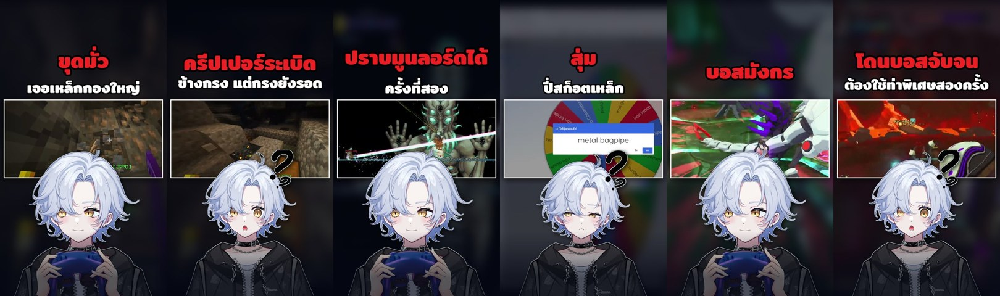

# ตัวอย่างปก Shorts ช่อง KATY404 — ชุด 2026-09-29 (v2, 30 ใบ)

ชุดต้นแบบสำหรับปกแนวตั้ง 1080×1920 ของ Katy404 จากโปรเจกต์ `KT404_2026-09-29` ผู้ใช้ตรวจและอนุมัติแล้ว
ภาพตัวอย่างอยู่ใน `katy404-shorts-v2/` (`contact.jpg` = 6 ใบ: #1, #4, #16, #19, #25, #30)
ตัวเรนเดอร์ต้นแบบ: `../../scripts/katy404_render_shorts_v2.py`

## ปัญหาของชุดเดิม (v1) ที่ v2 แก้
- ครอปเฟรมแนวนอนแล้วขยายราว 2 เท่าให้เต็มจอ → พิกเซลแตก เหลือภาพคมแค่แถบเล็กด้านบน
- hook เล็กและวางกลางภาพ ทับตัวหนังสือในเกม
- ใบหน้าอยู่ต่ำจนเข้าโซน UI ล่างของ Shorts
- ท่าอวาตาร์ซ้ำ (5 ท่าใน 30 ใบ)

## สูตรองค์ประกอบ (พิกัด 1080×1920)

| ส่วน | ค่า | หมายเหตุ |
|---|---|---|
| พื้นหลัง | เฟรมเกมเบลอ 28px + ผสมน้ำเงินเข้ม 68% | ใช้เติมพื้นที่เท่านั้น ภาพเกมจริงไม่เบลอ |
| ข้อความ | เริ่ม y≥285, กึ่งกลางแนวนอน, กว้างไม่เกิน 960 | จัดกึ่งกลางในโซนบนก่อนหน้าต่างเกม (เหลือง่ายต่อ 4:5 crop) |
| Hook (แดง `#EC1C24`) | Mitr Bold ขนาดเดียวกันทั้งชุด (132px) ขอบดำ 8% | ขนาดคำนวณจากบรรทัดแดงที่ยาวสุดของชุด |
| ข้อความรอง (ขาว) | Mitr Bold 96→60px ลดตามความยาว ขอบดำ 8% | 1 บรรทัดต่อสี ต่อกันต้องได้ชื่อไทม์ไลน์เดิม |
| หน้าต่างเกม | x 30–1050, y 650–1150 กรอบขาว 6px + เงา | ย่อจากเฟรม 1920×1080 ไม่ขยาย (ขยายเล็กน้อยเฉพาะ crop แคบ) |
| อวาตาร์ | กว้าง 900px กึ่งกลาง หัวเริ่ม y≈975 ทับขอบล่างหน้าต่างเกม ลำตัวทะลุขอบล่าง | ห้ามให้ขอบล่างลอย ต้องถูกตัดที่ขอบภาพ |
| Scrim ล่าง | เข้มขึ้นตั้งแต่ y1500 | ให้โซน UI ล่างสงบ ไม่เบลอเกม |

## บทเรียน
1. **ทำให้โมเดลติดขอบล่าง:** ถ้าขอบล่างของโมเดลเห็นได้ ภาพจะดูลอย ให้ขยายหรือเลื่อนจนลำตัวทะลุเฟรม
2. **ใหญ่ vs. ปลอดภัย:** ยิ่งโมเดลใหญ่และติดล่าง ปากยิ่งเลยเส้น y1440 (โซน UI) ใบนี้ยอมให้ปากอยู่ราว y1500 ตามที่ผู้ใช้สั่ง; ไหล่ขวาล้ำโซนปุ่ม (x>880) แต่ใบหน้าอยู่กลางภาพ
3. **ภาพเกมคมสำคัญกว่าเต็มจอ:** หน้าต่างกว้างเต็มความกว้างที่ย่อลงดีกว่าครอปแนวตั้งที่ขยาย
4. **หัวโมเดลบังส่วนล่างกลางของเกม** ถ้าเหตุการณ์อยู่กลางภาพ ต้องปรับ `gameplay_crop`/`focus_point` เป็นรายใบ
5. **ข้อความในเกมอาจติดมา** (เช่น "You were slain" ใน #14) เป็นหลักฐานเหตุการณ์ ไม่ลบ แต่เลือกเฟรมที่มีข้อความน้อยกว่าถ้าทำได้
6. ท่าอวาตาร์ยังซ้ำ ควรจับคู่จากคลังท่าในรอบต่อไป

## ข้อมูลผลลัพธ์ที่ตรวจแล้ว
- 30 ใบ: 1080×1920, RGB, sRGB, ≤2MB, ชื่อไฟล์ตรงชื่อไทม์ไลน์ + `_9x16`
- `cli.verify` PASS 30/30, `cli.package` VERIFIED_PASS, QC ด้วยสายตาไม่พบ 🔴 CRITICAL (ข้อสังเกต 🟠🟡 ตามบทเรียนด้านบน)
