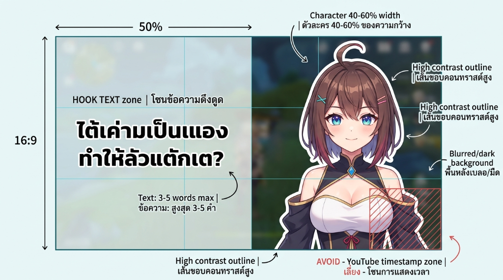
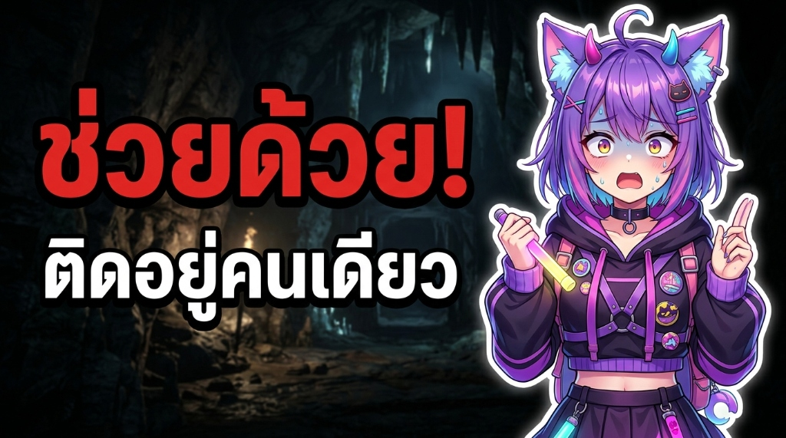

# Thai VTuber & KATY404 Thumbnails Guide

แนวทางและมาตรฐานการสร้างปกคลิป YouTube แนวนอน (16:9) และ YouTube Shorts (9:16) สำหรับ **VTuber ไทย** และสไตล์ **KATY404** เพื่อเพิ่มอัตราการคลิกเข้าชม (High-CTR) ทั้งการสร้างผ่าน Canva และการสร้างผ่านเครื่องมือเรนเดอร์ Python/Pillow โดยตรง

---

## 📐 โครงสร้างมาตรฐานปกคลิป VTuber ไทย (16:9 Layout Anatomy)

อ้างอิงจากผังองค์ประกอบมาตรฐาน ([thai-vtuber-layout-guide.png](references/previews/thai-vtuber-layout-guide.png)) และตัวอย่างปกจริง ([thai-vtuber-example-chuey-duay.jpg](references/previews/thai-vtuber-example-chuey-duay.jpg)):



```
+------------------------------------+------------------------------------+
|                                    |                                    |
|   [ โซนข้อความดึงดูด (HOOK TEXT) ]    |   [ ตัวละคร VTuber (ครึ่งตัว) ]      |
|   - ฝั่งซ้าย 50% ของความกว้าง          |   - ฝั่งขวา 40–60% ของความกว้าง          |
|   - สูงสุด 3–5 คำ (1–2 บรรทัด)       |   - เห็นศีรษะ ไหล่ หน้าอก ถึงเอว/กระโปรง |
|   - Hook หลัก: สีแดง Mitr Bold ใหญ่    |   - เส้นขอบคอนทราสต์สูง (ขอบขาวหนา)     |
|   - ข้อความรอง: สีขาว Mitr Bold รอง    |   - สีหน้าและอารมณ์ตรงกับเหตุการณ์      |
|   - ขอบดำหนา + เงาตกกระทบ             |                                    |
|                                    |               [เลี่ยงมุมขวาล่าง!]    |
|   [ พื้นหลังเบลอ/มืด + Gradient ซ้าย ]|               [YouTube Timestamp]  |
+------------------------------------+------------------------------------+
```

### 1. กฎการแบ่งครึ่ง 50/50 (Left/Right Balance)
- **ฝั่งซ้าย (50%):** สำหรับข้อความ Hook และบริบท เพื่อให้สายตาผู้ใช้ที่กวาดจากซ้ายไปขวาอ่านข้อความได้ทันที
- **ฝั่งขวา (40–60%):** สำหรับตัวละคร VTuber โดยให้ตัวละครมีสัดส่วนใหญ่เต็มตาในแนวตั้ง (สูง 85–95% ของความสูงภาพ)

### 2. ตัวละครต้องเห็น "ครึ่งตัว" (Half-Body / Bust-up) เสมอ
- **ห้ามใช้ตัวละครเต็มตัวย่อส่วน (No Full-Body Downscaling):** การย่อตัวละครทั้งตัวลงในปกแนวนอนจะทำให้ใบหน้ามีขนาดเล็กมาก ดวงตาและรอยยิ้ม/ความตกใจจะเลือนรางเมื่อมองบนหน้าจอมือถือ (Squint Test ล้มเหลว)
- **ตำแหน่งการตัดภาพ (Cropping):** ตัดตั้งแต่ส่วนบนสุดของศีรษะ/หู ลงมาถึงช่วงเอว เข็มขัด หรือสะโพกบน (Waist-up / Mid-torso)
- **จัดวางชิดขอบล่าง:** ให้ส่วนล่างสุดของตัวละครจรดขอบล่างของภาพพอดี ไม่ลอยอยู่กลางอากาศ

### 3. เส้นขอบคอนทราสต์สูง (High Contrast Outline)
- ต้องมี **เส้นขอบสีขาว (White Stroke)** ความหนา 12–16px ล้อมรอบตัวละครทุกจุด
- ซ้อนด้วย **เงาดำฟุ้ง (Soft Drop Shadow)** ความกว้าง 18–22px ด้านหลังเส้นขอบขาว เพื่อผลักตัวละครให้ลอยเด่นออกมาจากพื้นหลังที่มีรายละเอียด

### 4. โซนที่ต้องเลี่ยงเด็ดขาด (YouTube Timestamp Safe Zone)
- **มุมขวาล่างของภาพ (ความกว้าง ~25%, ความสูง ~20% จากมุมขวาล่าง):** จะถูกกล่องแสดงเวลาของ YouTube (เช่น `10:24`) ทับเสมอ
- **ข้อห้าม:** ห้ามวางข้อความสำคัญ ใบหน้า หรือจุดเกิดเหตุหลักไว้ที่มุมขวาล่าง หากตัวละครอยู่ฝั่งขวา ให้แน่ใจว่าลำตัวส่วนล่างหรือแขนเท่านั้นที่สัมผัสมุมนี้ ใบหน้าต้องอยู่ช่วง 2/3 บนเสมอ

---

## ✍️ ลำดับชั้นข้อความและการพาดหัว (Typography & Hook Hierarchy)



### 1. ความยาวข้อความ: สูงสุด 3–5 คำ (1–2 บรรทัด)
- บนหน้าจอมือถือ คนดูตัดสินใจในเวลาเพียง 0.5 วินาที ข้อความต้องสั้น กระชับ และสื่ออารมณ์รุนแรงที่สุด
- ห้ามใส่ประโยคยาวหรืออธิบายยืดยาว ตัวอย่างที่ดี:
  - *"ช่วยด้วย! / ติดอยู่คนเดียว"* (ตัวอย่างจากภาพจริง)
  - *"กินแต่เซเว่น! / วนลูป 3 เมนูทุกเช้า"*
  - *"ได้ใจหนูไปแล้ว! / ถ้าคุณคามิเป็นผู้สาว..."*
  - *"รักแม่เขามา 10 ปี?! / มาเฟียอยากได้ก็แค่คว้า"*

### 2. ลำดับสีและฟอนต์ (Color & Font Rules)
- **ฟอนต์:** ใช้ **Mitr Bold** (หรือฟอนต์ไทยไม่มีหัวทรงหนาและโมเดิร์น เช่น DB Heavent / Kanit Bold)
- **Hook หลัก (Main Hook):** ต้องเป็นคำที่กระแทกอารมณ์ที่สุด ขนาดใหญ่ที่สุด (120–145px บน 1080p) ใช้ **สีแดงสด** (`#EC1C24` หรือ `#E50914`) พร้อมขอบดำหนา (~14–18px)
- **ข้อความรอง (Secondary Text):** ให้บริบทหรือขยายความ ขนาดเล็กกว่า (70–85px) ใช้ **สีขาวล้วน** (`#FFFFFF`) พร้อมขอบดำหนา (~10–12px)
- **ห้ามแดงทั้งสองบรรทัด:** การใช้สีแดงทุกคำจะทำให้สูญเสียจุดนำสายตา ต้องคงสีแดงไว้เฉพาะ Hook หลักเท่านั้น

---

## 📱 ปก YouTube Shorts (9:16 Portrait Standard)

สำหรับการทำปกแนวตั้ง 1080×1920:

1. **การจัดวางตัวละคร:** วางตัวละครไว้ **กึ่งกลางแนวนอน (x = 540)** โดยให้ลำตัวส่วนล่างชนขอบล่างของหน้าจอ ขนาดตัวละครต้องใหญ่เต็มตา (สูง ~1100–1200px)
2. **โซนข้อความปลอดภัย (Top 1/3 Safe Zone):**
   - ข้อความ Hook และข้อความรองต้องอยู่ **ช่วง 1/3 บนของจอ (y = 300–550)**
   - จัดกึ่งกลางแนวนอน (Center Alignment)
   - **เหตุผล:** เพื่อหลบปุ่ม Like, Dislike, Comment, Share และแถบเสียงที่อยู่ฝั่งขวาของหน้าจอ Shorts รวมถึงแถบชื่อช่องและคำอธิบายที่อยู่ด้านล่าง
3. **การไล่น้ำหนักสีพื้นหลัง:** ทำ Dark Gradient บริเวณ 40% ด้านบนของภาพ เพื่อให้อักษรสีขาวและแดงอ่านได้ชัดเจน 100%

---

## 🎨 การจัดการไฟล์โมเดลตัวละคร (Character Asset Rules)

1. **การจับคู่อารมณ์กับเนื้อหา (Emotional Matching):**
   - ตรวจสอบคำพูดและบริบทจริงในคลิปก่อนเลือกรูปโมเดล เช่น เล่าเรื่องกลัว/ตกใจ ใช้หน้าช็อกหรือหน้ามืด; เล่าเรื่องขำๆ ปลงๆ ใช้หน้าหัวเราะตาปิด; เล่าเรื่องกวนๆ หยอดหวาน ใช้หน้าแลบลิ้นหรือหน้ายิ้มเขี้ยว
   - ห้ามใช้โมเดลสีหน้าเดียวซ้ำกันตลอดทั้งชุดคลิป
2. **การทำความสะอาดพิกเซลตกค้าง (Alpha Cleaning):**
   - ไฟล์ PNG จาก Live2D หรือโปรแกรมวาดภาพมักมีเม็ดพิกเซลโปร่งแสงลอยโดดเดี่ยว (Stray Alpha Islands) เช่น มุมขวาบนหรือขอบภาพ
   - ต้องตรวจสอบและลบพิกเซลลอยเหล่านี้ทิ้งก่อนการทำ Outlining มิฉะนั้นตัวกรอง Dilation จะสร้างเส้นขอบขาวลอยอยู่กลางอากาศ
3. **การครอบตัดจากตัวเต็ม (Full-body to Half-body):**
   - เมื่อได้รับไฟล์ตัวเต็ม (Full-body) ให้คำนวณ Bounding Box ของส่วนที่มองเห็น แล้วครอปเฉพาะตั้งแต่ขอบบนของศีรษะลงมาถึงระดับเข็มขัดหรือสะโพกบน (ประมาณ 55–60% ของความสูงตัวเต็ม)

---

## 🌄 การจัดการภาพพื้นหลัง (Atmospheric Background)

1. **ความลึกและบรรยากาศ (Cinematic Depth):**
   - ใช้เฟรมจากคลิปเหตุการณ์จริง หรือฉากที่สื่อถึงเนื้อหา (เช่น เกมเพลย์, หน้าต่างแชท, สตรีมรูม)
   - เบลอฉากหลังด้วย Gaussian Blur (35–45px สำหรับแนวนอน, 45–60px สำหรับ Shorts) เพื่อลบความคมชัดของรายละเอียดและตัวหนังสือบนฉากหลังเดิม
2. **การคุมความสว่างและเกรเดียนท์มืด (Dark Shading):**
   - ลดความสว่างรวม (Brightness 0.40–0.45) และเร่งความสดของสีเล็กน้อย (Color 1.15–1.20)
   - **แนวนอน (16:9):** ใส่ Gradient สีดำมืดจากขอบซ้าย (x=0) ไล่มาถึงกลางภาพ (x=1150) เพื่อรองรับกล่องข้อความ
   - **แนวตั้ง (9:16):** ใส่ Gradient สีดำมืดจากขอบบน (y=0) ลงมาถึง y=700 เพื่อรองรับกล่องข้อความ Shorts

---

## 🛠️ ขั้นตอนการทำงานกับ DaVinci Resolve และหลาย Timeline

เมื่อได้รับโปรเจกต์ที่มีหลาย Timeline:
1. **Audit ตรวจสอบทุก Timeline สด:**
   - ใช้ DaVinci Resolve Scripting API หรือ MCP ดึงรายชื่อ Timeline, Resolution, FPS, Duration และ Subtitle Tracks
   - จับคู่ระหว่าง Timeline แนวนอน (16:9) และแนวตั้ง (9:16) จากชื่อและเนื้อหาจริง
2. **สกัด Hook จาก Subtitle จริง:**
   - อ่านข้อความจากแทร็ก Subtitle หรือ Text+ ของแต่ละ Timeline
   - ค้นหาประโยคที่เป็นจุดพีคหรือคำพูดเด่น (Punchline) เพื่อตั้งเป็น Hook หลัก 1–3 คำ
3. **สกัดเฟรมต้นทาง (Frame Extraction):**
   - ใช้ FFmpeg ดึงเฟรมจากไฟล์วิดีโอต้นทาง (`.mov` / `.mp4`) ในช่วงวินาทีที่เกิดเหตุการณ์
4. **สร้างและบันทึกผลงาน:**
   - บันทึกไฟล์ภาพเดี่ยวความละเอียดเต็มทั้งแบบ 16:9 (`1920×1080`) และ 9:16 (`1080×1920`)
   - บันทึกลงในโฟลเดอร์งานของผู้ใช้ (เช่น Google Drive `thumbnails/`) และโฟลเดอร์โปรเจกต์ `outputs/`
   - สร้างภาพรวม **Overview Contact Sheet** ทั้งแนวนอนและแนวตั้ง
   - สร้างไฟล์สรุป **`delivery-manifest.json`** และรวมเป็น **ZIP Package**

---

## ✅ เช็กลิสต์การตรวจงานก่อนส่ง (Quality Checklist)

- [ ] **การเห็นตัวละคร (Half-body Check):** ตัวละครเป็นภาพครึ่งตัว (ไม่ใช่เต็มตัวย่อส่วน) ขนาดใหญ่เต็มตา เห็นสีหน้าชัดเจน
- [ ] **การตัดเส้นขอบ (Outline Check):** มีขอบขาวหนา 12–16px และเงานุ่มรอบตัว ไม่มีจุดขาวลอยในอากาศ (Stray Pixels)
- [ ] **ลำดับข้อความ (Hierarchy Check):** Hook หลักสีแดงใหญ่เด่นชัด + ข้อความรองสีขาว รวมไม่เกิน 3–5 คำ
- [ ] **ฟอนต์และสระภาษาไทย (Thai Typography Check):** สระบน/ล่างและวรรณยุกต์ไม่ขาด ไม่ติดหาง ป ฝ ฟ และไม่ติดหัว ไ ใ โ
- [ ] **หลบมุมเวลา YouTube (Timestamp Safe Zone):** มุมขวาล่างไม่มีข้อความหรือจุดสำคัญที่ถูกกล่องเวลาทับ
- [ ] **Shorts Safe Zone:** ข้อความบน Shorts อยู่ช่วง 1/3 บน และตัวละครอยู่กึ่งกลางล่าง
- [ ] **Squint Test (320×180):** ย่อภาพดูที่ขนาดเล็กแล้วยังอ่าน Hook แดงออกและเห็นสีหน้าตัวละครชัดเจนทันที
- [ ] **ความถูกต้องของชื่อไฟล์:** ตั้งชื่อไฟล์ตรงกับชื่อ Timeline ต้นทางอย่างแม่นยำ
